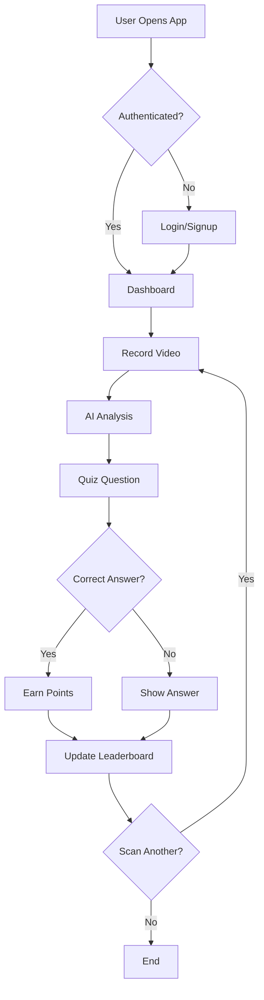

# Eco-Todo

**Eco-Todo** is an innovative web application that revolutionizes recycling education through AI-powered video analysis! Simply record or scan a recyclable item, and our intelligent system will provide detailed recycling instructions, eco-scores, and actionable sustainability tips. Join a global community of eco-warriors and compete on our leaderboard while making a positive environmental impact!

---

## Tech Stack

### Frontend
* **Framework:** Next.js 15 with React 19
* **Styling:** Tailwind CSS 4
* **Language:** TypeScript

### Backend & Services
* **Authentication & Database:** Firebase
* **AI Analysis:** Google Gemini 1.5 Flash
* **Build Tool:** Turbopack

### Key Libraries
* **@google/generative-ai:** Gemini AI
* **firebase:** Authentication and real-time database
* **next:** React framework with SSR

---

## Setup and Installation

### Environment Variables Setup

Create a `.env.local` file in the `eco-friendly-todo` directory and add the following environment variables:

```env
# Firebase Configuration
NEXT_PUBLIC_FIREBASE_API_KEY=your_firebase_api_key
NEXT_PUBLIC_FIREBASE_AUTH_DOMAIN=your_project_id.firebaseapp.com
NEXT_PUBLIC_FIREBASE_PROJECT_ID=your_firebase_project_id
NEXT_PUBLIC_FIREBASE_STORAGE_BUCKET=your_project_id.appspot.com
NEXT_PUBLIC_FIREBASE_MESSAGING_SENDER_ID=your_messaging_sender_id
NEXT_PUBLIC_FIREBASE_APP_ID=your_firebase_app_id

# Google Gemini AI Configuration
NEXT_PUBLIC_GEMINI_API_KEY=your_gemini_api_key
```

### Getting Your API Keys

#### Firebase Setup
1. **Go to [Firebase Console](https://console.firebase.google.com/)**
2. **Create a new project** or select an existing one
3. **Enable Authentication:**
   - Go to Authentication → Sign-in method
   - Enable Email/Password authentication
4. **Setup Realtime Database:**
   - Go to Realtime Database → Create database
   - Choose your security rules (start in test mode for development)
5. **Get your config:**
   - Go to Project Settings → General → Your apps
   - Add a web app and copy the Firebase configuration
   - Use these values for your `NEXT_PUBLIC_FIREBASE_*` environment variables

#### Google Gemini AI Setup
1. **Visit [Google AI Studio](https://aistudio.google.com/)**
2. **Sign in** with your Google account
3. **Create an API key:**
   - Click "Get API key" in the top right
   - Create a new API key or use an existing one
4. **Copy the API key** and use it for `NEXT_PUBLIC_GEMINI_API_KEY`

### Installation Steps

1. **Clone the repository:**
   ```bash
   git clone https://github.com/redhatsam09/dev-hack.git
   cd dev-hack
   ```

2. **Navigate to the project directory:**
   ```bash
   cd eco-friendly-todo
   ```

3. **Install dependencies:**
   ```bash
   npm install
   ```

4. **Set up environment variables:**
   ```bash
   cp .env.example .env.local
   # Edit .env.local with your actual API keys
   ```

5. **Start the development server:**
   ```bash
   npm run dev
   ```

6. **Open your browser:**
   Navigate to `http://localhost:3000` to see your app in action!

---

## API Endpoints

The application uses several internal API routes for seamless functionality:

* **`POST /api/analyze-video`** - Analyzes uploaded video content using Google Gemini AI
* **`POST /api/scan`** - Alternative scanning endpoint for image-based analysis

---

## Application Pages

* **`/`** - Landing page with app introduction and features
* **`/signup`** - User registration with Firebase authentication
* **`/login`** - User login portal
* **`/web-app`** - Main application interface with video recording and analysis
* **`/leaderboard`** - Global rankings and user statistics
* **`/profile`** - Personal user dashboard and settings

---

## How It Works



---

**For a sustainable future 🌱**
